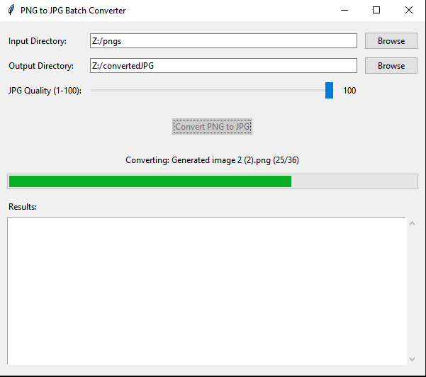

# PNG to JPG Batch Converter

A Python application with both GUI and command-line interfaces for batch converting PNG files to JPG format. Perfect for reducing file sizes while maintaining image quality.

## Features

- **Dual Interface**: Choose between an intuitive GUI or command-line interface
- **Batch Processing**: Convert multiple PNG files at once
- **Quality Control**: Adjustable JPG quality settings (1-100)
- **Transparency Handling**: Automatically converts transparent backgrounds to white
- **Progress Tracking**: Real-time conversion progress with detailed feedback
- **Flexible Output**: Choose custom output directories or use source directories
- **Error Handling**: Comprehensive error reporting and recovery
- **Cross-Platform**: Works on Windows, macOS, and Linux

### Screenshots

### GUI Interface
The user-friendly graphical interface makes batch conversion simple:
- Browse and select input/output directories
- Adjust quality settings with a visual slider
- Monitor conversion progress in real-time
- View detailed results and error reports

## Installation

### Prerequisites
- Python 3.6 or higher
- pip (Python package installer)

### Required Dependencies
```bash
pip install Pillow
```

### Download
1. Clone this repository:
```bash
git clone https://github.com/yourusername/png-to-jpg-converter.git
cd png-to-jpg-converter
```

2. Or download the script directly:
```bash
wget https://raw.githubusercontent.com/yourusername/png-to-jpg-converter/main/png_to_jpg_converter.py
```

## Usage

### GUI Mode (Recommended for beginners)

Launch the graphical interface:
```bash
python png_to_jpg_converter.py --gui
```

Or simply run without arguments:
```bash
python png_to_jpg_converter.py
```

**Steps:**
1. Click "Browse" next to "Input Directory" and select the folder containing PNG files
2. (Optional) Set a different output directory, or leave blank to save in the same location
3. Adjust the quality slider (95 is recommended for best quality)
4. Click "Convert PNG to JPG" and wait for completion

### Command Line Mode

Basic usage:
```bash
python png_to_jpg_converter.py /path/to/png/files
```

Advanced options:
```bash
python png_to_jpg_converter.py /path/to/input -o /path/to/output -q 85
```

#### Command Line Arguments

| Argument | Description | Default |
|----------|-------------|---------|
| `input_dir` | Directory containing PNG files | Required |
| `-o, --output` | Output directory for JPG files | Same as input |
| `-q, --quality` | JPG quality (1-100) | 95 |
| `--gui` | Launch GUI interface | - |

### Examples

**Convert all PNGs in current directory:**
```bash
python png_to_jpg_converter.py .
```

**Convert with custom output directory:**
```bash
python png_to_jpg_converter.py ./images -o ./converted_images
```

**Convert with lower quality (smaller file size):**
```bash
python png_to_jpg_converter.py ./photos -q 75
```

**Launch GUI:**
```bash
python png_to_jpg_converter.py --gui
```

## How It Works

1. **File Discovery**: Recursively finds all PNG files in the specified directory
2. **Format Conversion**: Converts PNG images to RGB format
3. **Transparency Handling**: Replaces transparent backgrounds with white
4. **Quality Optimization**: Compresses images with specified quality settings
5. **Batch Processing**: Processes multiple files with progress tracking

## Technical Details

- **Supported Input Formats**: PNG (including transparent PNGs)
- **Output Format**: JPG/JPEG with customizable quality
- **Background Color**: White background for transparent images
- **File Naming**: Preserves original filename with .jpg extension
- **Threading**: GUI uses background threads to prevent interface freezing

## Troubleshooting

### Common Issues

**"No PNG files found"**
- Ensure the input directory contains PNG files
- Check that you have read permissions for the directory

**"Permission denied" errors**
- Verify write permissions for the output directory
- Try running with administrator/sudo privileges if necessary

**Memory issues with large images**
- Process smaller batches
- Reduce the quality setting to lower memory usage

**GUI not appearing**
- Ensure tkinter is installed: `python -m tkinter`
- On Ubuntu/Debian: `sudo apt-get install python3-tk`

### Performance Tips

- Use quality settings between 85-95 for best size/quality balance
- Lower quality (60-80) for web images or when file size is critical
- Higher quality (95-100) for print or archival purposes

## Contributing

Contributions are welcome! Here are some ways you can help:

1. **Bug Reports**: Open an issue with detailed reproduction steps
2. **Feature Requests**: Suggest new features or improvements
3. **Code Contributions**: Submit pull requests with bug fixes or enhancements
4. **Documentation**: Help improve this README or add code comments

### Development Setup

1. Fork the repository
2. Create a feature branch: `git checkout -b feature-name`
3. Make your changes and test thoroughly
4. Commit with clear messages: `git commit -m "Add feature description"`
5. Push and create a pull request

## License

This project is licensed under the MIT License - see the [LICENSE](LICENSE) file for details.

## Changelog

### Version 1.0.0
- Initial release
- GUI and command-line interfaces
- Batch conversion support
- Quality control settings
- Progress tracking
- Error handling and reporting

## Support

If you encounter any issues or have questions:

1. Check the [Issues](https://github.com/yourusername/png-to-jpg-converter/issues) page
2. Create a new issue with:
   - Your operating system
   - Python version
   - Error messages (if any)
   - Steps to reproduce the problem

## Acknowledgments

- Built with [Pillow (PIL)](https://pillow.readthedocs.io/) for image processing
- GUI created with Python's built-in tkinter library
- Inspired by the need for simple, reliable batch image conversion

---

⭐ If this tool helped you, please consider giving it a star on GitHub!
